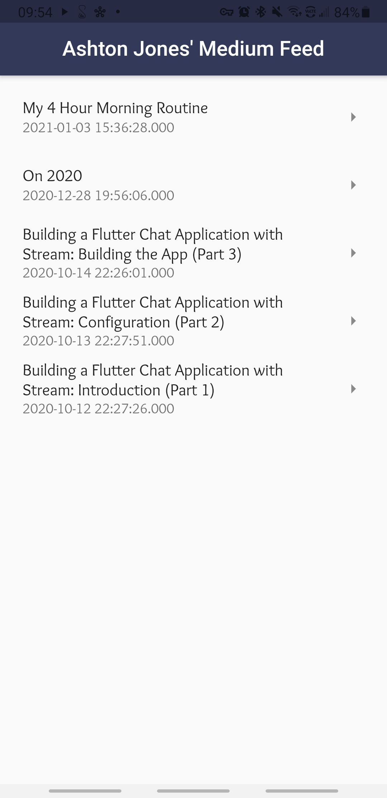

# 📖 Ashton Jones' Medium Feed

A Flutter app with an RSS feed of my Medium articles (https://tjgrapes.medium.com/)

-------

## 🖥 Technologies used

<b>Built with</b>
- Flutter SDK
- Dart

## 📚 Libraries used

* [http](https://pub.dev/packages/http)
* [webfeed](https://pub.dev/packages/webfeed)
* [url_launcher](https://pub.dev/packages/url_launcher)

## 👨🏻‍💻 Developed By
[Ashton Jones](https://www.ashtonjones.dev/) 

👨‍💻 Google Certified Android Engineer |
✍ Writer |
🧘‍♂️ Stoic && Meditator
👨🏻‍💻 Ashton Jones
📩 ashtonjonesdev@gmail.com
🌐 www.ashtonjones.dev

Copyright 2021 Ashton Jones

## 📸 Screenshots

